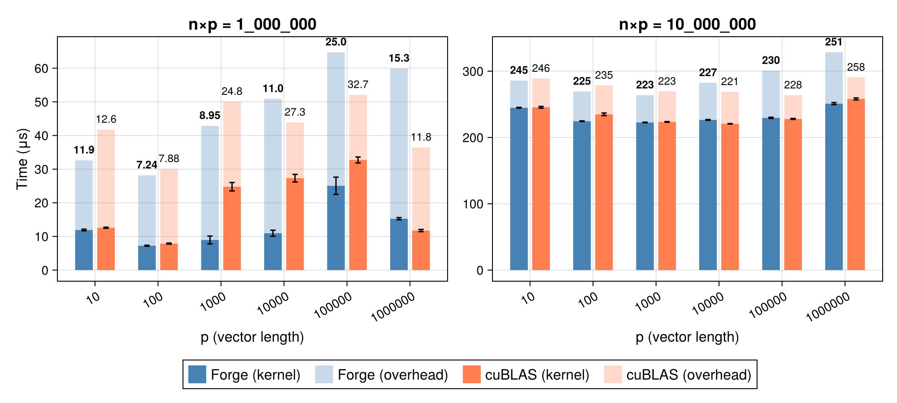
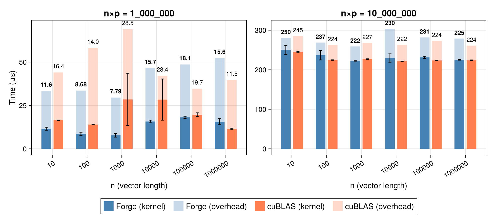

# Performance

KernelForge.jl achieves performance comparable to optimized CUDA C++ libraries such as CUB. Benchmarks report two metrics:

- **Kernel time**: Execution time of the main kernel, measured using `@profile` from CUDA.jl
- **Overhead**: Total time minus kernel time, including memory allocations and data transfers

## Copy

CUDA.jl leverages the proprietary libcuda library for memory copies, which internally vectorizes loads and stores. In contrast, the cross-platform GPUArrayCore.jl relies on KernelAbstractions.jl, which does not currently perform vectorization. KernelForge's `vcopy!` bridges this gap by using `vload` and `vstore` operations built on unsafe pointer access via LLVMPtrs from KernelIntrinsics.jl.

The graph below compares memory bandwidth for Float32 and UInt8 data types. With vectorized loads and stores, KernelForge achieves bandwidth comparable to CUDA.jl for both types. The slight underperformance below the L2 cache threshold stems from our current vectorization factor (×8 for Float32); increasing this to ×16 would close the remaining gap.

## Map-Reduce

KernelForge.jl matches CUDA.jl performance on Float32 and significantly outperforms it on smaller types (UInt8, UnitFloat8), even when converting to Float32 during reduction. These gains result from optimized memory access patterns and vectorized loads/stores.

## Scan

KernelForge's scan kernel rivals CUB performance on Float32 and Float64, while additionally supporting non-commutative operations and custom types such as Quaternions. This is achieved through an efficient decoupled lookback algorithm combined with optimized memory access.

## Matrix-Vector Operations

KernelForge implements matrix-vector and vector-matrix operations for general types and operators. For benchmarking, we compare against CUDA.jl on Float32, which internally calls cuBLAS's `gemv` routine.

Due to column-major memory layout, matrix-vector and vector-matrix multiplications have fundamentally different access patterns. KernelForge therefore provides separate optimized kernels for each operation.

For both benchmarks, we fix the total matrix size (n × p) and vary n from 10 to (n × p) / 10, sweeping from tall-narrow to short-wide matrices. The black line indicates the reduced overhead achieved when the user provides pre-allocated temporary memory.

**Matrix-Vector**

**Vector-Matrix**

